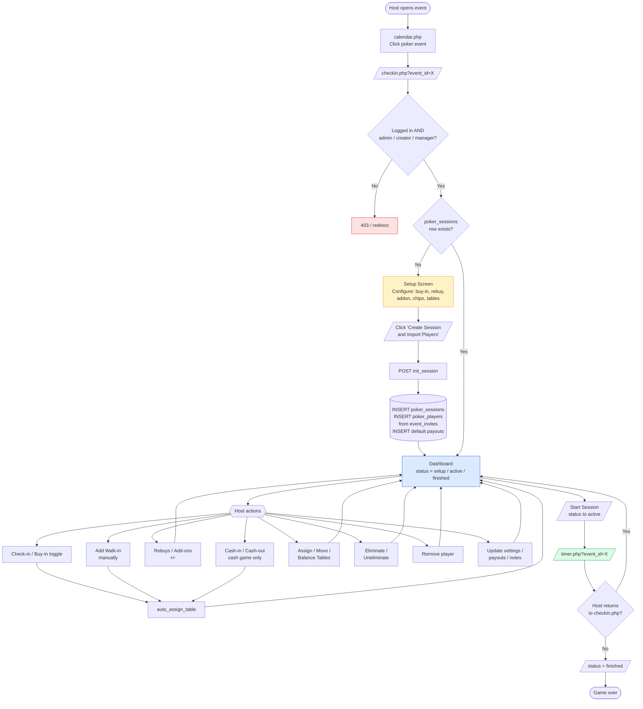
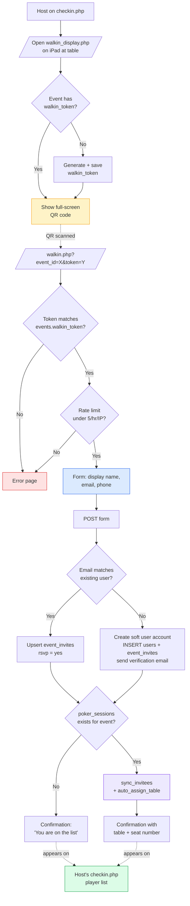
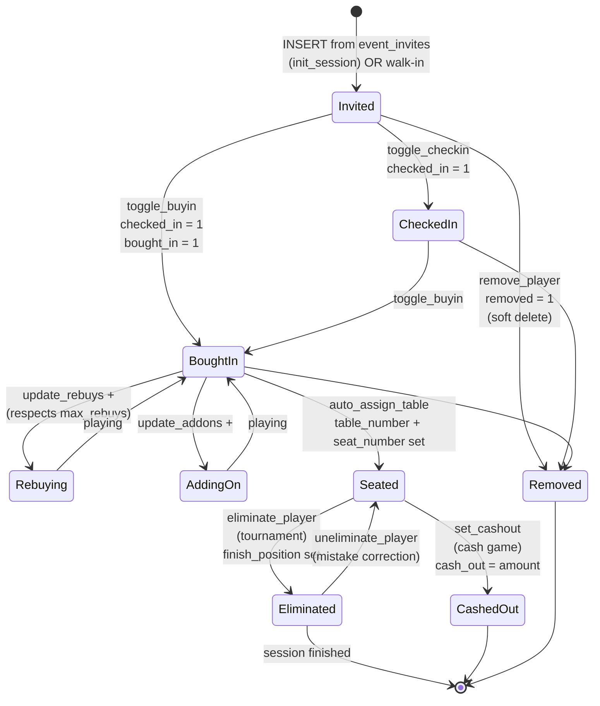
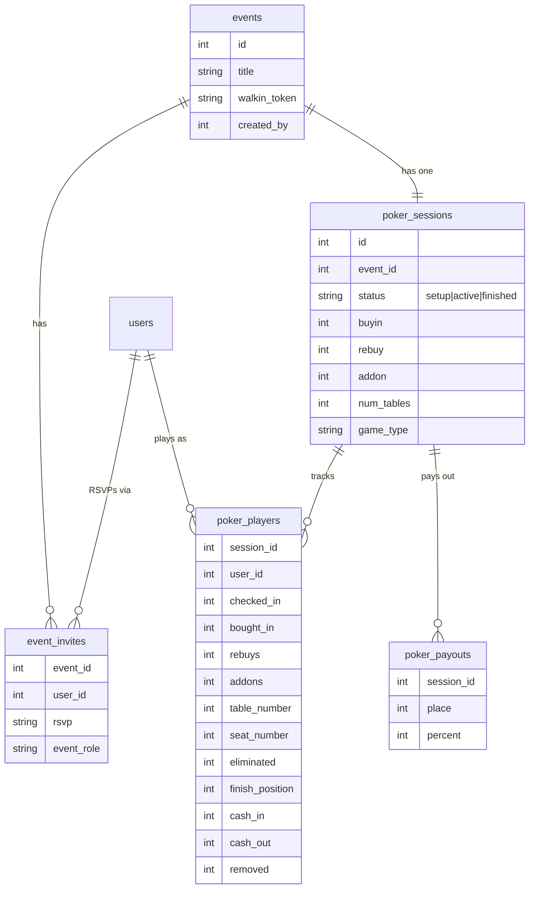

# Check-In Process — Flow Chart

Visual reference for the GameNight poker check-in flow. Covers the host's `checkin.php` dashboard, the walk-in QR registration via `walkin.php`, and the hand-off to `timer.php`.

> Rendered as [Mermaid](https://mermaid.js.org/). GitHub, VS Code, and most markdown viewers render these natively — just open this file.

---

## 1. High-level flow (host's perspective)

---

## 2. Walk-in (guest) registration flow

How a walk-up player joins a live game by scanning the QR code at the registration table.

---

## 3. Player state machine

The states a single `poker_players` row moves through during a game.

---

## 4. Database tables touched

---

## Quick reference — host actions → backend

All host actions POST to `/checkin_dl.php` with CSRF token and an `action` parameter. Key actions:

| UI action | `action` param | Main DB effect |
|---|---|---|
| Create session + import | `init_session` | INSERT poker_sessions, bulk INSERT poker_players |
| Check-in player | `toggle_checkin` | UPDATE checked_in; auto-assign table |
| Buy-in player | `toggle_buyin` | UPDATE checked_in=1, bought_in=1; auto-assign |
| Add walk-in manually | `add_walkin` | INSERT poker_players; auto-assign |
| Rebuy +/- | `update_rebuys` | UPDATE rebuys (bounded by max_rebuys) |
| Add-on +/- | `update_addons` | UPDATE addons |
| Move to table | `set_table` / `move_player_table` | UPDATE table_number, seat_number |
| Balance tables | `break_up_table` | UPDATE num_tables; rebalance all seats |
| Eliminate | `eliminate_player` | UPDATE eliminated=1, finish_position |
| Un-eliminate | `uneliminate_player` | UPDATE eliminated=0 |
| Cash-in (cash game) | `add_cashin` / `set_cashin` | UPDATE cash_in |
| Cash-out (cash game) | `set_cashout` | UPDATE cash_out (validates against pool) |
| Update payouts | `update_payouts` | DELETE + re-INSERT poker_payouts |
| Remove player | `remove_player` | UPDATE removed=1 (soft delete) |
| Change status | `update_status` | UPDATE status: setup → active → finished |

All of these refresh the dashboard in place — no page reload, no state lost. The host can leave for `timer.php` and come back at any time; state lives in the database.
